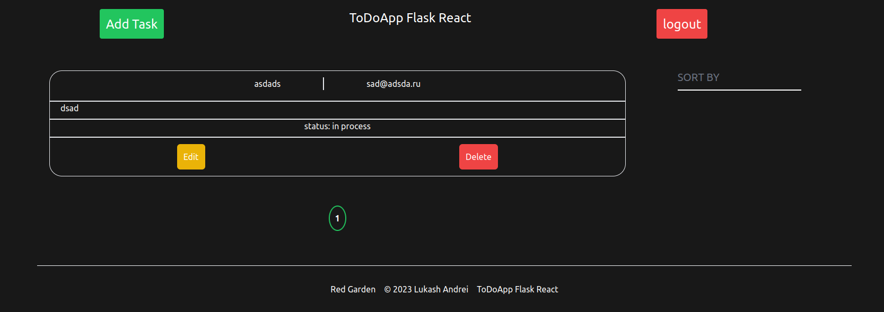

<h1> ToDo App <h2>

<h4> Application description</h4>

ToDo app with authentication system, pagination, sorting. 


<h4>Basic frameworks and libraries:</h4>

<ui>backend</ui>
<li>Flask
<li>SQLalchemy
<li>psycopg2</li>

<ui>frontend</ui>
<li>React
<li>TypeScript
<li>axios
<li>tailwind

<h4>Screen of application</h4>




<h4>Steps to activate the project on linux machine:</h4>
<p> 1. Clone git repository to your machine:</p>

```
git clone https://github.com/lukash-ST88/ToDoApp_FlaskReact.git
```

<p> 2. Setup backend - create and activate virtual environment: </p>

```
cd backend

python -m venv [name]

source [name]/bin/activate
```
<p>3. Install all requirements: </p>

```
pip install -r requirements.txt 
```

<p> 4. Create .env file and fill it with your own database and backend data: </p>

```
SECRET_KEY=some-secret-key

POSTGRES_USER=user
POSTGRES_PASSWORD=pass
POSTGRES_HOST=localhost
POSTGRES_PORT=5432
POSTGRES_NAME=name
```
<p> 5. Migrate data to database:</p>

```
python3 -m flask db migrate 
python3 -m flask db upgrae 
```
<p> 6. Run the server side: </p>

```
flask --app app run 
```
<p> 7. Setup frontend - install all requirements:</p>

```
cd frontend

npm install 
```
<p> 8. Start the client side:</p>

```
npm start
```